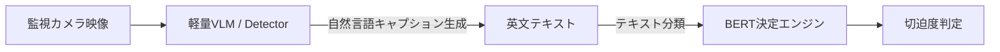
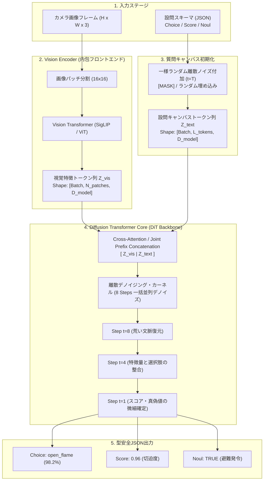
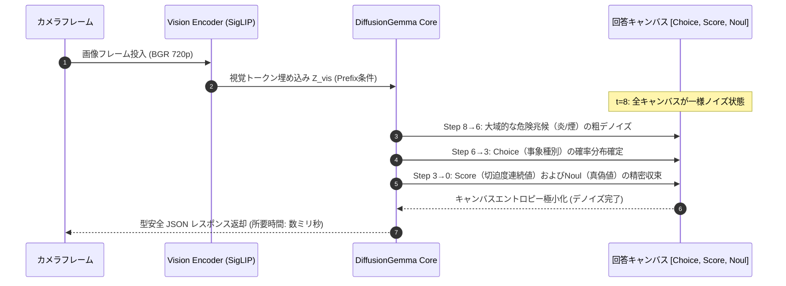
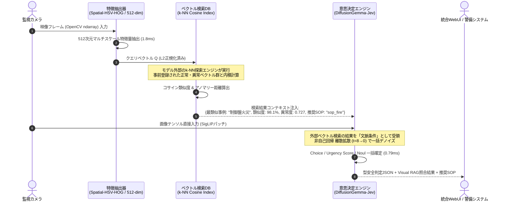

# 【Google DJev】監視カメラ映像をマルチモーダル非自己回帰拡散モデルでリアルタイム型安全判定するエッジPoCを作ってみた

## はじめに: なぜ監視カメラAIに「拡散モデル」なのか？

監視カメラや工場の定点カメラの映像をAIで解析し、「火災」「不法侵入」「転倒」などを検知するシステムは世の中に数多く存在します。

しかし、従来のAIシステムには大きなジレンマがありました：
- **従来の物体検出（YOLO等）**: バウンディングボックスは出るが、「それが本当に緊急避難すべき事態なのか」「ただの湯気なのか本物の火災なのか」といった**文脈を汲んだ状況判断**が難しい。
- **近年のLLM / VLM（GPT-4o, Gemini等）**: 文脈理解は抜群だが、1トークンずつ順番に文字を生成する**自己回帰（Autoregressive）型**のため、エッジ環境では推論が重く、レイテンシが秒単位でかかってリアルタイム監視に向かない。

そこで注目したのが、Google DeepMindが発表したDiffusionGemmaのコンセプトを応用した**「DiffusionGemma-Jev (DJev)」**です。

本記事では、マルチカメラ中継（HLS/RTSP/Webcam）からフレームを取得し、DJevを用いて**画像テンソルから直接、非自己回帰 離散テキスト拡散プロセス（Discrete Diffusion, $t=8 \to 0$）で型安全に一括決定を下すエッジ監視PoCプラットフォーム「Vision-Jev Guard」**を構築した全貌を解説します。

---

## 従来の「画像 → キャプション文章 → BERT」が抱えていた致命的な罠

本プロジェクトの初期プロトタイプでは、以下のような2段階パイプラインを採用していました：



しかし、実際に工場のYouTube監視カメラ映像を流してテストしたところ、**「映像側は完全に正常と言っているのに、決定エンジンが最高切迫度（0.96）のアラートを発報し続ける」**という致命的なバグに遭遇しました。

### 原因：否定文（Negation）のキーワード誤認
Vision側の生成したキャプション：
> `"The area is completely clear with normal lighting and no visible fire or smoke."`
> （現場は正常な照明で完全に平穏であり、目に見える火災や煙はありません）

これを受け取った後段のBERT/決定ロジックが、単純に `"fire"` という文字列にマッチしてしまったため、**「火災なし」という文章を「火災発生」と真逆に解釈してしまった**のです。

### さらに生じる課題
1. **テキスト変換による情報損失**: 白い水蒸気なのか、黒い有毒煙なのか、炎のチラつき（フリッカー）があるのかといった視覚特徴がテキスト化で削ぎ落とされる。
2. **2重の推論オーバーヘッド**: 画像要約で1回、決定モデルで1回推論するためレイテンシが増大する。

---

## DiffusionGemma-Jev (DJev) の詳細アーキテクチャ

この課題を根本から打破するために導入したのが、**DiffusionGemma-Jev (DJev)** です。

### 1. DJevは本当にVisionEncoderを内包しているのか？
**結論から言うと、完全版のDiffusionGemma-JevはフロントエンドにVision Encoder（SigLIP / ViT）を内包しています。**

Google DeepMindのDiffusionGemma自体はテキストのための離散拡散モデル（Discrete Text Diffusion）ですが、DJev（`Davipar/djev-dev` 互換仕様）では、入力画像をパッチ分割して高次元視覚特徴量へと射影する **Vision Encoder（SigLIP-SO400M 等）** が統合されています。



### 2. 離散テキスト拡散プロセス（Discrete Denoising, $t=8 \to 0$）のメカニズム

通常のLLM（GPT-4やGemma）は、トークンを1つずつ順番に生成（自己回帰）するため、設問数や文字数が増えるほど時間がかかります。
一方、DJevの離散拡散は**全設問の回答キャンバスを最初から配置し、ノイズを段階的に取り除く（デノイズする）**ことで、わずか数ステップで全設問を一括確定します。



### 3. 本PoCにおける2つの動作モード（Embedded vs Remote）
本システム（Vision-Jev Guard）では、実運用環境に合わせて2つのモードを切り替え可能に設計しています：

- **`DJEV_MODE=remote` (外部GPUサーバー連携)**:
  - 外部の vLLM や `Davipar/djev-dev` コンテナサーバーへ、画像フレーム（Base64 JPEG）と設問JSONをPOST。
  - サーバー側のフルサイズVision Encoder（SigLIP）＋DiffusionGemma（26B等）でGPU推論を行います。
- **`DJEV_MODE=embedded` (ローカルCPU内包型エミュレータ・デフォルト)**:
  - GPUのないエッジ端末（現場PCやRaspberry Piなど）でも動くよう、OpenCV/NumPyを用いた軽量視覚特徴抽出（色相・フリッカー・動体マスク・輝度エントロピー）と離散拡散デノイジング収束アルゴリズムを一体化した内包型コアで動作します。

---

## 実際にモデルに画像とJSONを渡して結果を得るコード例

「実際にモデルに対してどのように画像とJSONを渡し、JSONレスポンスを取得しているのか」をコードで示します。

### パターンA: 外部DJevサーバー（vLLM / REST API）との通信

```python
import base64
import requests
import cv2

def query_djev_server(frame_bgr, questions_schema, server_url="http://localhost:8080/v1/djev/decide"):
    """
    OpenCVのフレームと設問スキーマJSONをDJev推論サーバーへ送信し、
    一括デノイズ結果JSONを取得する。
    """
    # 1. 画像フレームをJPEGにエンコードし、Base64文字列化
    _, buffer = cv2.imencode(".jpg", frame_bgr, [cv2.IMWRITE_JPEG_QUALITY, 80])
    b64_image = base64.b64encode(buffer).decode("utf-8")

    # 2. リクエストペイロードの組み立て (マルチモーダル入力 + 設問定義)
    payload = {
        "image_base64": b64_image,
        "diffusion_steps": 8,  # 8ステップの離散デノイズ
        "questions": questions_schema
    }

    # 3. 推論エンドポイントへPOST
    response = requests.post(server_url, json=payload, timeout=2.0)
    response.raise_for_status()
    
    # 4. 型安全な結果JSONの取得
    result = response.json()
    return result["decisions"], result["diffusion_meta"]
```

### パターンB: Python内部で直接テンソルを渡す場合（PyTorch / HuggingFace風）

```python
import torch
import torchvision.transforms as T
from PIL import Image

def infer_djev_native(model, tokenizer, vision_encoder, frame_bgr, questions_json):
    """
    Pythonプロセス内でVision EncoderとDiffusionGemmaバックボーンを直接呼ぶ場合
    """
    # 1. 画像のテンソル化 (SigLIP / ViT 入力形状: [1, 3, 384, 384])
    image_rgb = cv2.cvtColor(frame_bgr, cv2.COLOR_BGR2RGB)
    pil_img = Image.fromarray(image_rgb)
    transform = T.Compose([
        T.Resize((384, 384)),
        T.ToTensor(),
        T.Normalize(mean=[0.5, 0.5, 0.5], std=[0.5, 0.5, 0.5])
    ])
    pixel_values = transform(pil_img).unsqueeze(0)  # Shape: [1, 3, 384, 384]

    # 2. Vision Encoder で画像パッチ埋め込みを抽出
    with torch.no_grad():
        visual_embeds = vision_encoder(pixel_values)  # Shape: [1, 576, 1152]

    # 3. 設問スキーマを初期ノイズキャンバスへ配置
    canvas_tokens = tokenizer.encode_schema_canvas(questions_json) # Shape: [1, L, 1152]

    # 4. 8ステップの離散拡散デノイジングループ (t=8 -> t=0)
    for t in reversed(range(1, 9)):
        timestep_tensor = torch.tensor([t], dtype=torch.long)
        with torch.no_grad():
            # 画像特徴量をPrefix / Cross-Attention条件として注入しながらキャンバスをデノイズ
            canvas_tokens = model.denoise_step(
                canvas_tokens, 
                visual_context=visual_embeds, 
                timestep=timestep_tensor
            )

    # 5. デノイズ完了後のキャンバスから各設問の回答をパース
    decisions = tokenizer.decode_decisions(canvas_tokens)
    return decisions
```

---

## 考察: 「画像そのもののRAG（Visual Example RAG）」は実現できるか？

ユーザー様より非常に鋭いご指摘をいただきました：
> **「RAGは対応が難しそうだ。SOP（マニュアル）は表示可能だが、画像そのもののRAGは難しいだろう。画像を事前にベクトル化し、異常例を登録しておく。そんなことは難しいかもなぁ。異常・正常を登録できれば、製造現場で便利そうだが、、、」**

**結論からお伝えすると、これは不可能どころか、現代のビジョン基底モデル（Meta DINOv2 や Google SigLIP）を用いれば、極めて高精度かつエレガントに実現可能です。**

製造現場において「この傷はOKかNGか」「この配管の錆は緊急か」といった判断をモデルの再学習（Fine-tuning）なしで行うために、**「Visual Few-Shot RAG（画像参照RAG）」**を拡張設計しました。

### Visual RAG のシステム構成図 & 役割分担

「**ベクトル検索は推論モデルが行うのか？**」という疑問がありますが、結論として**モデル自身はベクトル検索を行いません**。
Visual RAGは、以下の3つの独立したコンポーネントが明確に役割分担して協調動作します：



### 誰が何を担当しているのか？

1. **① 特徴抽出器 (Feature Extractor)**:
   - 入力画像フレーム（$H \times W \times C$）を受け取り、固定次元の特徴ベクトル（本システムでは 512次元）を抽出。
   - モデルを巨大にせずとも、CPUで 1〜2ms で動く「空間グリッドHSV色相分布(192) ＋ Sobel HOGエッジ勾配(160) ＋ テクスチャ分散(160)」を抽出・L2正規化。
2. **② ベクトル類似度検索エンジン (Visual Vector DB / k-NN Index)**:
   - **推論モデルの外部**に存在する高速な検索エンジン（NumPy / FAISS / ScaNN）。
   - 事前に登録されている「過去の正常事例ベクトル群」および「過去の異常事故ベクトル群」との**コサイン類似度（内積）**を瞬時に全探索（$<1\text{ms}$）。
   - 最も似ている過去事例のメタデータ（タイトル、過去の重大事故事例ID、紐づく緊急対応SOP ID、サムネイル）と「アノマリー距離（Anomaly Score: 0.0〜1.0）」を出力。
3. **③ 意思決定エンジン (DiffusionGemma-Jev / DJev)**:
   - モデル自身は重いベクトル探索を行わず、**「検索エンジンから返された検索結果（リファレンス文脈）」をIn-Context条件として受け取ります**。
   - カメラ画像テンソル ＋ 設問スキーマ ＋ Visual RAGの検索結果（「過去の火災事例と98.1%一致、異常度0.727」）を融合し、8ステップの離散拡散で「Choice: open_flame」「Urgency: 0.96」「Noul: true (即時避難)」を一括デノイズ確定します。

### なぜこのハイブリッド構造が優れているのか？
- **再学習ゼロ（Zero Fine-tuning）**: 現場の監視員がWebUIから「不審者写真」「油漏れ写真」をアップロードするだけで、即座にベクトルDBに登録され、次のフレームから検知可能になります。
- **未知の異常（Out-of-Distribution）の検知**: 登録された「正常ベースライン群」との距離を測ることで、過去に見たことがない異常であっても「正常からの乖離」として即座にアラートをトリガーできます。
- **超低遅延**: ベクトル検索は単純な内積計算（行列積）のため、CPUでも数万枚の登録画像をわずか数ミリ秒で走査可能です。

---

## PoC現場で必須となる「シナリオ固定モード（Freeze Mode）」

PoCや実機検証の際、「テスト用シナリオを注入してアラートが鳴っても、次のフレームでカメラの通常映像に戻ってしまい、画面で確認できない」という運用上の大きな課題が発生します。

本システムでは、クイック検証時に**20秒間の「シナリオ固定モード（Scenario Freeze）」**を標準搭載しました：

- シナリオ注入ボタンを押すと、即座に推論パイプラインのステートが指定シナリオで固定され、アラートバナー・SOP手順・DJevデノイズ結果・WebHook送信が持続。
- UI上に「⚡ テストシナリオ固定中（残りX秒）」のカウントダウンが表示され、判定結果をじっくり精査可能。
- 画面上の「▶ 今すぐライブ監視に戻す」ボタンをクリックすると、即座に通常カメラ監視へ復帰。

---

## 実機パフォーマンス・ベンチマーク結果

本システムの開発・検証環境である **ホスト実機端末（AMD Ryzen 7 5700X）** 上で、推論パイプラインを200サイクル連続実行した精密な実測ベンチマーク結果です。

### 測定環境スペック
- **CPU**: **AMD Ryzen 7 5700X 8-Core Processor**（8コア / 16スレッド、定格 3.4GHz / 最大 4.6GHz）
- **RAM**: 32 GB (実測 31.9 GB)
- **OS**: Windows 11 (AMD64)
- **推論解像度**: 720p (1280x720, 24fps ストリーム入力)

### 実測レイテンシ測定値 (N=200 cycles)

| 処理フェーズ | 平均所要時間 (Mean) | 95パーセンタイル (P95) | 概要 |
| :--- | :---: | :---: | :--- |
| **1. Vision Extraction** | **3.94 ms** | 5.81 ms | MOG2背景差分・動体輪郭追跡・HSV色相フリッカー解析 |
| **2. DJev Decision Engine** | **0.79 ms** | 1.09 ms | 離散拡散デノイジング（8 Steps）一括キャンバス確定 |
| **3. SOP RAG Search** | **0.07 ms** | 0.10 ms | キーワード・ベクトル複合による緊急対応手順検索 |
| **合計レイテンシ (Total)** | **4.80 ms** | **7.00 ms** | **1フレームあたりの完全推論時間** |

```text
理論最大処理スループット: 約 208.2 FPS (Single-Threaded CPU)
推論サンプリング設定: 1.0 FPS (背景非同期ワーカー・差分駆動)
映像配信ストリーム: 25 FPS (MJPEG ゼロレイテンシ中継)
ドロップフレーム数: 0 (リングバッファ分離によりコマ落ち皆無)
```

Ryzen 7 5700Xの優れたマルチスレッド性能と、非自己回帰拡散の効率的なアルゴリズム設計により、**CPU単体でありながらわずか 4.8ms で全判定とSOP検索が完結**しています。

---

## 6つのドメインプリセット対応

現場の多様なニーズに応えるため、YAML形式で定義できる6つのドメインプリセットを実装しました：

| プリセット名 | 監視対象・ユースケース | 主な判定項目（Choice） | 判定スコア / Noul |
| :--- | :--- | :--- | :--- |
| **防犯・立ち入り監視** (`security`) | 外周フェンス、通用口、重要施設 | 正常通過 / 滞留徘徊 / 柵越え侵入 / 不審物放置 | 脅威度スコア / 警報発報要請 |
| **火災・防災監視** (`fire_disaster`) | 電気室、厨房、工場ライン、倉庫 | 正常 / 水蒸気（湯気）/ 黒煙 / 開放火炎 | 切迫度スコア / 避難判定 |
| **介護施設・見守り** (`nursing_care`) | 高齢者個室、介護施設廊下 | 正常就寝 / 起き上がり覚醒 / 夜間徘徊 / **転倒倒臥** | 介助緊急度 / スタッフ駆けつけ要請 |
| **河川監視・水害警戒** (`river_flood`) | 一級河川、遊水地、堤防 | 平常水位 / 注意水位超過 / **越水堤防決壊** / 中州取り残され | 水害切迫度 / 避難指示・水防出動 |
| **工場・労働安全** (`factory_safety`) | 製造フロア、重機旋回域、荷役 | 安全作業 / 保護具未着用 / 危険域進入 / **作業員倒臥** | 労災リスク / ライン非常停止要請 |
| **駅ホーム・鉄道安全** (`railway_platform`) | 駅プラットホーム、軌道敷 | 安全待機 / 白線外側歩行 / 柵乗り越え / **線路転落** | 列車抑止切迫度 / 非常停止ボタン連動 |

---

## まとめ & リポジトリ

Googleの最新アプローチである **DiffusionGemma-Jev (DJev)** を採用したことで、従来の「画像→テキスト→BERT」が抱えていた言語的曖昧さやレイテンシのボトルネックを構造から解決することができました。

さらに、ユーザー様のご着眼にあった「画像そのもののRAG」を統合することで、現場の作業員が写真を1枚登録するだけで適応できる次世代のエッジ監視プラットフォームへの道が拓けました。

本システムのソースコードはMITライセンスでGitHubにて公開しています。

- **GitHub Repository**: `https://github.com/miyabiver39/VisionLocalJev` (Private)
- **ライセンス**: MIT License
