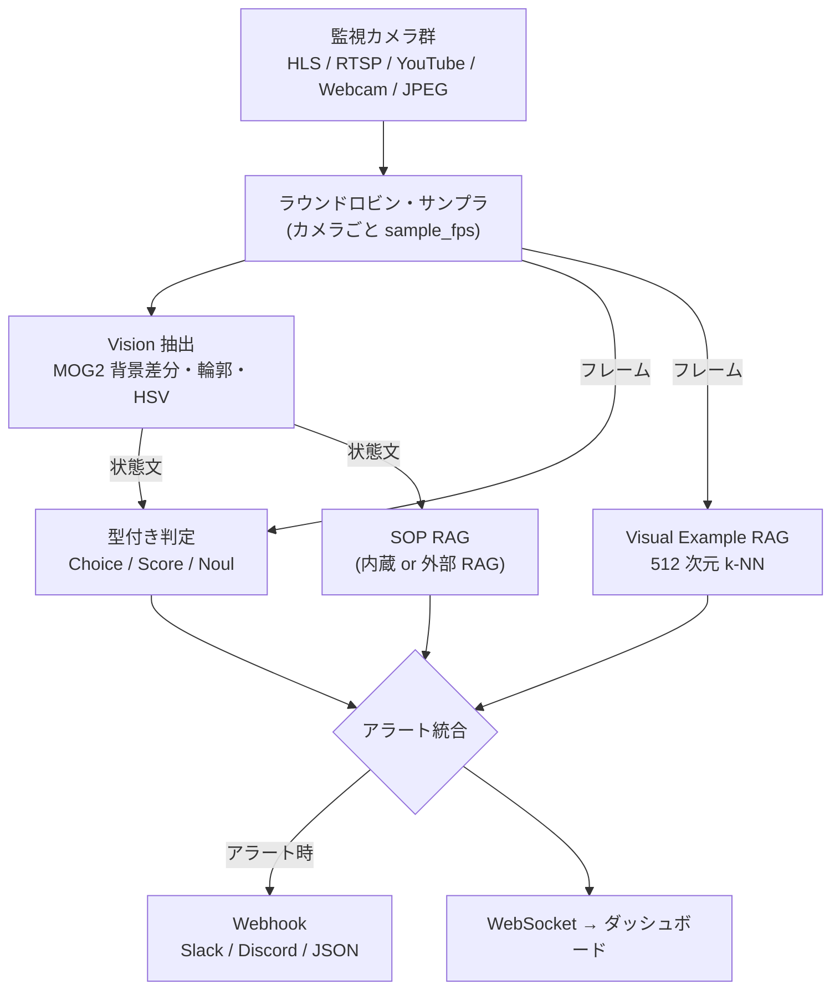
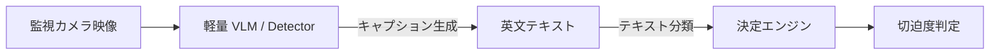
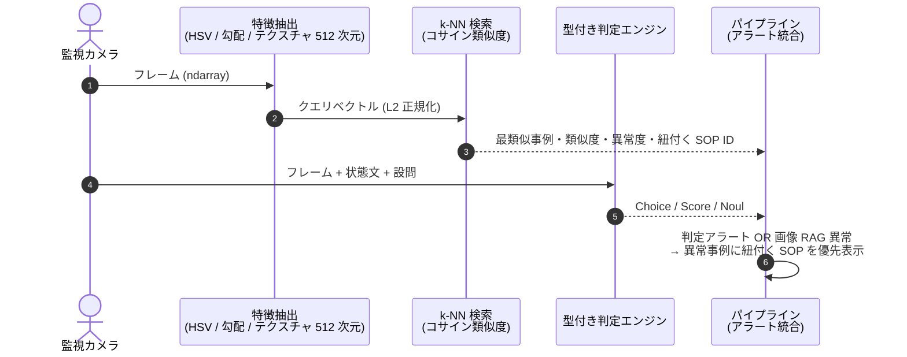

## はじめに

監視カメラや工場の定点カメラの映像から「火災」「不法侵入」「転倒」などを検知する仕組みは数多くあります。ただ、実際に作ろうとすると次のジレンマにぶつかります。

- **物体検出（YOLO 等）**：バウンディングボックスは出るが、「ただの湯気か本物の火災か」「本当に避難が必要か」といった**文脈を踏まえた判断**は別途ロジックが必要
- **VLM / LLM**：文脈理解は得意だが、自由文を 1 トークンずつ生成する**自己回帰型**なので、出力の揺れやパース処理、レイテンシがリアルタイム監視の足かせになる

そこで着目したのが、2026 年 6 月に Google DeepMind が公開した離散拡散 LLM **[DiffusionGemma](https://deepmind.google/models/gemma/diffusiongemma/)** と、その上に「型付きの判定」レイヤを載せた OSS **[DJev（Davipar/djev-dev）](https://github.com/Davipar/djev-dev)** です。DJev は「Text in. Images in. Decisions out.」を掲げ、自由文ではなく **Choice / Score / Noul（Yes/No）** という型付きの設問に対して、検証済みの構造化回答を返します。

本記事では、この **「型付き設問で判定する」インターフェースを監視カメラに持ち込んだエッジ監視 PoC「Vision-Jev Guard」** を作った内容と、作ってみて分かった落とし穴を紹介します。

:::note warn
**先にお断り**：DJev 本体は DiffusionGemma-26B を GPU（リファレンス環境は NVIDIA B200）で動かすシステムです。本 PoC のデフォルト構成（`DJEV_MODE=embedded`）は、GPU のないエッジ PC でもパイプライン全体を試せるように作った **CPU エミュレータ**（OpenCV の特徴量＋ルールベースのロジット計算）であり、**DiffusionGemma のモデル推論は行っていません**。本記事の性能値もこのエミュレータ構成の値です。
:::

<!-- TODO: ダッシュボードのスクリーンショット / GIF を挿入 -->

## 作ったもの

- HLS / RTSP / YouTube / Web カメラ / HTTP JPEG の **N 台のカメラ**をラウンドロビンでサンプリング
- 各フレームを **6 つのドメインプリセット**（防犯・火災・介護・河川・工場・駅ホーム）の型付き設問で判定
- 判定に応じて **SOP（緊急初動手順）を RAG で引き当て**、Slack / Discord / 汎用 JSON の **Webhook** で通知
- 画像そのものを登録して正常・異常の過去事例と照合する **Visual Example RAG**
- FastAPI + WebSocket のダッシュボード（マルチカメラ MJPEG・判定カード・SOP・性能 HUD）



## きっかけ：「画像 → キャプション → テキスト分類」の否定文問題

初期のプロトタイプは、VLM / 検出器で映像を英文キャプションにし、それをテキスト分類器で判定する 2 段構成でした。



工場の監視カメラ映像で試したところ、**映像は平常なのに最高切迫度のアラートが出続ける**という現象が起きました。原因はキャプションのこの一文です。

> `"The area is completely clear with normal lighting and no visible fire or smoke."`

後段が `"fire"` という文字列に反応し、**「火災なし」を「火災あり」と読んでいた**のです。加えて、

1. **テキスト化による情報損失**：白い湯気か黒煙か、炎のちらつきがあるか、といった視覚情報が削ぎ落とされる
2. **推論の二重化**：キャプション生成と判定で 2 回推論するぶん遅くなる

という構造的な問題もありました。

本来の解決策は、**画像と設問を 1 つのモデルに直接渡し、型付きの答えだけを返させる**ことです。これがまさに DJev の設計思想であり、本 PoC の `DJEV_MODE=remote` が目指す構成です。一方、GPU のないエッジで動かす `embedded` エミュレータでは、キーワード直前 25 文字に否定語（`no` / `not` / `without` / `clear of` など）があれば無視する**否定語ウィンドウ**で対処しています。

```python:app/decision.py（抜粋）
def _has_unnegated(self, text: str, keywords: List[str]) -> bool:
    """Negation filtering."""
    negations = ["no ", "not ", "non-", "never ", "without ", "clear of ", "free of ", "no visible "]
    for kw in keywords:
        pos = 0
        while True:
            idx = text.find(kw, pos)
            if idx == -1:
                break
            prefix = text[max(0, idx - 25):idx]
            if any(neg in prefix for neg in negations):
                pos = idx + len(kw)
                continue
            return True
    return False
```

## 型付き設問：Choice / Score / Noul

判定内容はプリセット YAML で宣言します。自由文を返させるのではなく、**答えの型と選択肢を先に決めておく**のがポイントです。

```yaml:app/presets/security.yaml
id: "security"
name: "防犯・立ち入り監視"
questions:
  - id: "action_type"
    type: "choice"
    label: "行動種別"
    choices: ["normal_passing", "loitering", "trespassing", "unattended_object"]
  - id: "threat_score"
    type: "score"
    label: "脅威度スコア"
    rubric: "Rate security risk from 0 (completely safe) to 1 (critical breach)."
  - id: "requires_alert"
    type: "noul"
    label: "警報発報要請"
    hypothesis: "Immediate security response or staff intervention is required."
```

返ってくる結果も型が決まっているので、後段は `if score >= threshold` のような単純なコードで扱えます。LLM の自由文をパースしたり、プロンプトで出力形式を懇願したりする必要がありません。

```json
{
  "action_type":   { "type": "choice", "selected": "trespassing", "confidence": 1.0,
                     "probabilities": { "normal_passing": 0.0, "loitering": 0.0, "trespassing": 1.0, "unattended_object": 0.0 } },
  "threat_score":  { "type": "score", "score": 0.92, "confidence": 0.95 },
  "requires_alert":{ "type": "noul",  "value": true, "confidence": 0.9 }
}
```

アラートは「Score がしきい値以上」または「Noul が true かつ確信度がしきい値以上」で発報します（しきい値は UI から変更可能）。

### 6 つのドメインプリセット

| プリセット | 主な判定（Choice） | Score / Noul |
| :--- | :--- | :--- |
| 防犯・立ち入り (`security`) | 正常通過 / 滞留徘徊 / 柵越え侵入 / 不審物放置 | 脅威度 / 警報発報要請 |
| 火災・防災 (`fire_disaster`) | 正常 / 水蒸気（湯気）/ 黒煙 / 開放火炎 | 切迫度 / 避難判定 |
| 介護・見守り (`nursing_care`) | 正常就寝 / 起き上がり / 夜間徘徊 / 転倒 | 介助緊急度 / 駆けつけ要請 |
| 河川・水害 (`river_flood`) | 平常水位 / 注意水位超過 / 越水・決壊 / 取り残され | 水害切迫度 / 避難指示 |
| 工場・労働安全 (`factory_safety`) | 安全作業 / 保護具未着用 / 危険域進入 / 作業員倒臥 | 労災リスク / ライン非常停止 |
| 駅ホーム (`railway_platform`) | 安全待機 / 白線外側 / 柵乗り越え / 線路転落 | 列車抑止切迫度 / 非常停止 |

YAML を 1 枚追加すれば新しいドメインを増やせます。

## 2 つの動作モード

| | `embedded`（デフォルト） | `remote` |
| :--- | :--- | :--- |
| 実行場所 | エッジ PC の CPU | 外部の推論サーバー |
| 中身 | OpenCV 特徴量（炎色 HSV マスク等）＋キーワード・否定語ルールでロジットを作り、softmax で確率化 | 画像（Base64 JPEG）と設問をサーバーへ POST |
| 用途 | GPU なしでパイプライン全体（UI・RAG・Webhook）を検証 | 本物の DiffusionGemma / DJev で判定 |

`embedded` は、DJev と同じ **Choice / Score / Noul の入出力形式**を CPU だけで再現したエミュレータです。UI や通知まわりを先に作り込み、判定エンジンだけ後から差し替えられるようにする、という割り切りです。

:::note info
`remote` モードのリクエスト形式は、現時点では djev-dev の公開 API（`POST /v1/request`、`questions` はオブジェクト形式）とまだ一致していません。対応状況は [Issue #15](https://github.com/miyabiver39/VisionLocalJev/issues/15) で管理しています。
:::

## Visual Example RAG：画像そのものを参照する RAG

テキストの SOP（手順書）検索に加えて、**「現場の正常な写真」「過去の異常事例の写真」を登録しておき、今のフレームがどちらに近いか**を照合する Visual Example RAG を入れました。モデルの再学習なしで、現場担当者が WebUI から写真を登録するだけで照合対象を増やせます。

### 役割分担

ベクトル検索は判定エンジンの**外側**で行い、その結果を判定エンジンの結果と**後段で統合**しています（判定エンジンへの入力にはしていません）。



### 特徴量

深層モデルを使わず、CPU で計算できる手作り特徴量を連結して 512 次元にしています。

| 特徴 | 次元 | 内容 |
| :--- | ---: | :--- |
| 空間グリッド色分布 | 192 | 4×4 グリッド × (H/S/V 各 4 ビン) |
| エッジ勾配方向 | 160 | 4×4 グリッド × Sobel 勾配方向 10 ビン（強度重み付き） |
| テクスチャ | 160 | 4×4 グリッド × 局所コントラスト 10 ビン |

より意味的な類似を取りたい場合は、ここを DINOv2 や SigLIP の埋め込みに置き換えるのが次のステップです（検索と統合の仕組みはそのまま使えます）。

### 判定ロジック

「異常事例に近い」だけでなく、**「一番近い正常ベースラインより明確に異常事例に近い」**ことを条件にしています。

```python:app/visual_rag.py（抜粋）
margin = max_anom_sim - (max(normal_sims) if normal_sims else 0.0)
strong_anomaly_match = bool(
    top_match
    and top_match["is_anomaly"]
    and top_match["similarity"] >= self.STRONG_MATCH_SIMILARITY   # 0.90
)
is_anomalous = margin >= self.ANOMALY_MARGIN and (                  # 0.05
    anomaly_score >= self.ANOMALY_SCORE_THRESHOLD or strong_anomaly_match
)
```

この条件にした理由は、次の「落とし穴」で説明します。

## 作ってみて分かった落とし穴

PoC を一通り動かした後にコードを見直したところ、「動いているように見えて実は壊れている」箇所がいくつも見つかりました。同じような構成を作る方の参考になれば幸いです。

### 1. コサイン類似度を `(cos + 1) / 2` で正規化したら、何でも「異常」になった

一般的なベクトルのコサイン類似度は `[-1, 1]` なので、`(cos + 1) / 2` で `[0, 1]` にそろえるのはよくある処理です。しかし今回の埋め込みは**ヒストグラム由来で全要素が非負**なので、コサイン類似度は元から `[0, 1]` です。そこへこの変換をかけると値が `[0.5, 1]` に押し込められ、「類似度 0.80 以上なら一致」というしきい値が**実質「生のコサイン 0.6 以上」**になっていました。

結果、無関係な合成テスト映像でも 6 プリセット中 5 つで「異常」と判定され、**デフォルト構成のまま起動すると毎秒アラートが出る**状態でした。生のコサイン類似度を使い、正常ベースラインとのマージンを判定条件に加えることで解消しています。

> **教訓**：類似度のしきい値を決める前に、ベクトルの値域（非負かどうか）を確認する。そして「無関係な画像で誤検知しないこと」をテストに入れる。

### 2. SOP 検索が「a」で当たっていた

SOP のキーワード照合で、`any(token in keyword for token in query_tokens)` のように**クエリ側トークンがキーワードの部分文字列かどうか**を見ていました。すると `a` や `in` がほぼ全キーワードに含まれるため、

> `"A person in standard work attire is walking through the entrance corridor normally."`

という平常文に対して「外周柵越え・不法侵入の対応手順」が表示されていました。単語単位の一致（語幹の前方一致は 3 文字以上）とストップワード除外、否定語の考慮に変えて解消しています。

### 3. 背景差分モデルを全カメラで共有していた

MOG2 の背景差分モデルを 1 インスタンスだけ持ち、ラウンドロビンで**別カメラのフレームを交互に投入**していました。背景モデルが毎回別シーンで更新されるため、マルチカメラ時は画面全体が「動体」になります。背景モデルと滞留判定の状態を**カメラごと**に持つよう修正しました。

### 4. 検知枠の描画が炎検知に混入していた

動体検出の結果をフレームに直接描画していましたが、そのフレームがそのまま後段の判定と画像 RAG にも渡っていました。しかも枠の色（アンバー）が**炎色の HSV 範囲に入っていた**ため、描いた枠そのものが炎の画素として数えられていました。推論用フレームには描画しない、という当たり前のルールの大切さを痛感しました。

### 5. その他

- 存在しないプリセット ID を 1 台に設定すると、推論ループが例外→1 秒待機を繰り返し、**全カメラの推論が止まる**
- MJPEG 配信を同期ジェネレータで書いていたため、**視聴者 1 人ごとにスレッドを 1 本占有**し続ける
- WebUI で `innerHTML` にカメラ名などを未エスケープで埋め込んでおり、**保存型 XSS** があった
- 全 API が無認証だった（現在は `AUTH_USERNAME` / `AUTH_PASSWORD` で Basic 認証を有効化可能）

いずれも修正し、**pytest によるテスト（60 件）と GitHub Actions の CI** を追加しました。特に 1. と 2. は「異常は検知できている」ので手動の動作確認では気付きにくく、**「正常なものを正常と判定できるか」のテスト**が効きました。

## 性能（CPU エミュレータ構成）

`scripts/benchmark_pipeline.py` で、1 フレームあたりの各処理時間を計測しました（サーバー・ネットワークなし、各ステージを直列実行）。

- **CPU**：AMD Ryzen 7 5700X（8 コア / 16 スレッド）
- **RAM**：32 GB / **OS**：Windows 11
- **ソフトウェア**：Python 3.14.2 / OpenCV 5.0.0
- **入力**：1280×720 の動体入りテスト映像、`security` プリセット、200 サイクル（ウォームアップ 20 回を除外）

| 処理 | 平均 | 中央値 | P95 |
| :--- | ---: | ---: | ---: |
| Vision 抽出（MOG2・輪郭・HSV） | 3.50 ms | 3.47 ms | 4.20 ms |
| 型付き判定（embedded エミュレータ） | 0.68 ms | 0.65 ms | 0.93 ms |
| SOP RAG 検索 | 0.12 ms | 0.11 ms | 0.16 ms |
| Visual Example RAG（特徴抽出＋照合） | 5.56 ms | 5.44 ms | 6.81 ms |
| **合計** | **9.86 ms** | **9.70 ms** | **11.74 ms** |

1 スレッドで毎秒約 100 フレームを処理できる計算です。実運用では各カメラ 1 fps 程度でサンプリングしているため、CPU 1 台で多数のカメラを捌く余裕があります。**一番重いのは判定ではなく Visual RAG の特徴抽出**で、DINOv2 などに置き換える場合はここが GPU 化の候補になります。

なお、DJev 本体（DiffusionGemma-26B、GPU）のレイテンシはこれとは別物です。djev-dev の README には過去の計測値としてテキスト入力で p50 76.87 ms / p95 86.40 ms が掲載されています（現行リリースのベンチマークではないとの注記付き）。

```bash
python scripts/benchmark_pipeline.py --cycles 200 --width 1280 --height 720
```

## PoC で便利だった「シナリオ固定モード」

検証時にテストシナリオ（例：「フェンスを乗り越えようとしている人物」）を注入しても、次のフレームで実映像の判定に戻ってしまい、画面で結果を確認しきれない問題がありました。

そこで、クイックテストボタンで注入したシナリオを**20 秒間固定**する機能を入れました。

- 固定中は判定カード・SOP・アラートバナー・Webhook 送信がそのシナリオで持続
- 画面に「テストシナリオ固定中（残り X 秒）」とカウントダウンを表示
- 「今すぐライブ監視に戻す」ボタンで即座に解除

デモや関係者への説明で重宝しています。

## 試し方

```bash
git clone https://github.com/miyabiver39/VisionLocalJev.git
cd VisionLocalJev
AUTH_USERNAME=admin AUTH_PASSWORD=change-me docker compose up -d --build
```

`http://localhost:8000` を開くとダッシュボードが表示されます（合成テスト映像のカメラが 1 台登録済み）。「カメラ追加」から HLS / RTSP / YouTube の URL を登録できます。

:::note warn
デフォルトでは `0.0.0.0:8000` で待ち受けます。ネットワークから到達できる環境では、必ず `AUTH_USERNAME` / `AUTH_PASSWORD` を設定してください。
:::

## まとめ

- 監視の判定を**自由文ではなく型付き設問（Choice / Score / Noul）**にすると、後段の通知・SOP 連携・テストが非常に書きやすくなる
- DiffusionGemma / DJev の形式に合わせておくことで、**UI や通知まわりは CPU エミュレータで先に作り、判定エンジンは後から GPU のモデルに差し替える**という進め方ができる
- 画像の RAG（Visual Example RAG）は、手作り特徴量でも「登録するだけで照合対象が増える」体験は作れる。ただし**類似度の値域としきい値には要注意**
- 「異常を検知できるか」だけでなく、**「正常を正常と判定できるか」をテストする**ことが大事

今後は、`remote` モードを djev-dev の API に対応させて実際の DiffusionGemma で判定させること、Visual RAG の特徴量を DINOv2 / SigLIP に置き換えることに取り組む予定です。

## リポジトリ

- GitHub：https://github.com/miyabiver39/VisionLocalJev （MIT License）

## 参考

- [DiffusionGemma — Google DeepMind](https://deepmind.google/models/gemma/diffusiongemma/)
- [DiffusionGemma model overview | Google AI for Developers](https://ai.google.dev/gemma/docs/diffusiongemma)
- [DiffusionGemma: The First Diffusion LLM (dLLM) Natively Supported in vLLM | vLLM Blog](https://vllm.ai/blog/2026-06-10-diffusion-gemma)
- [Davipar/djev-dev（DJev）](https://github.com/Davipar/djev-dev)
