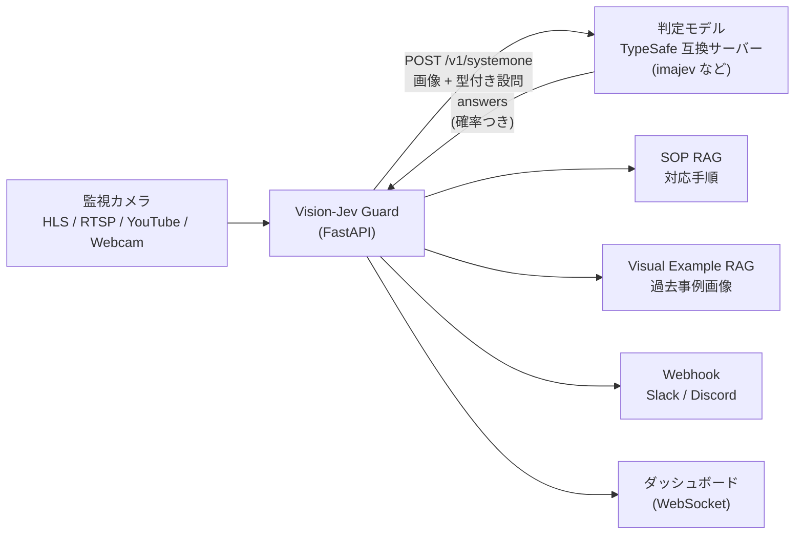

## はじめに

監視カメラの映像から「火災」「転倒」「線路への転落」などを判定し、対応手順（SOP）の提示と通知まで行うエッジ監視 PoC「**Vision-Jev Guard**」を作っています。

この記事では、判定部分を **「型付き設問（Choice / Score / Noul）」で答える判定モデル** に置き換え、

- 判定 API を **TypeSafe 社の System One API 形式** に統一し
- 画像を読める Jev 互換モデル **imajev** を **ローカルの AMD Radeon RX 9060 XT（16GB）** で動かし
- アプリと推論サーバーを **docker compose 一発で起動** できるようにした

ところまでを、実測値と、途中でハマった点を交えて紹介します。

:::note info
リポジトリ: https://github.com/miyabiver39/VisionLocalJev （MIT License）
:::

<!-- TODO: ダッシュボードのスクリーンショット / GIF を挿入 -->

## 作ったもの



- 複数カメラをラウンドロビンでサンプリングし、フレームごとに判定
- 6 つのドメインプリセット（防犯・火災・介護・河川・工場・駅ホーム）
- 判定結果に応じて SOP（緊急初動手順）を引き当て、Webhook で通知
- 画像そのものを登録して過去事例と照合する Visual Example RAG

## なぜ「型付き設問」なのか

VLM に「この画像で何が起きていますか？」と聞くと、答えは自由文で返ってきます。監視システムで使うには、その文章をパースして「アラートを出すか」を決める必要があり、ここが不安定になりがちです。

そこで、**答えの型と選択肢を先に決めておき、モデルには各選択肢の確率だけを返させる** 方式にしました。TypeSafe 社の [Jev](https://docs.typesafe.ai/) が提唱している考え方で、設問は次の 3 種類です。

| 型 | 内容 | 返り値 |
|---|---|---|
| **Choice** | 選択肢から 1 つ選ぶ | 選ばれた選択肢、各選択肢の確率、confidence |
| **Score** | 順序のある段階で評価する | 段階の期待値、各段階の確率、confidence |
| **Noul** | Yes / No を判定する | Yes の確率 |

文章を生成しないので、答えは必ず選択肢のどれかになり、後段は `if answer["noul"] >= 0.8:` のような単純なコードで扱えます。

### プリセット（設問の定義）

設問は YAML で定義します。形式は TypeSafe の Question 形式（`type` / `instructions` / `criteria`）そのままで、`label` だけ画面表示用に足しています。

```yaml:app/presets/fire_disaster.yaml（抜粋）
questions:
  - id: "hazard_type"
    type: "choice"
    label: "検知対象"
    instructions: "What fire-related hazard, if any, is visible in this scene?"
    criteria:
      none: "No smoke, steam or fire"
      steam_vapor: "Harmless white steam or water vapour (e.g. a kettle)"
      dark_smoke: "Dense dark or black smoke"
      open_flame: "Visible open flames or fire"
  - id: "urgency_score"
    type: "score"
    label: "切迫度"
    instructions: "How immediate is the threat to life or property?"
    criteria:
      - "None: the scene is safe"
      - "Low: harmless steam or heat source"
      - "Moderate: smoke of unknown origin"
      - "High: spreading smoke or small fire"
      - "Critical: active fire or dense smoke endangering people"
  - id: "evacuate"
    type: "noul"
    label: "避難判定"
    instructions: "Does visible fire or dangerous smoke require immediate evacuation?"
```

## 判定 API を TypeSafe System One 形式に統一する

判定エンジンの入出力は、[TypeSafe System One API](https://docs.typesafe.ai/api) の形式にそろえました。

```json:リクエスト
{
  "model": "imajev-4b",
  "state": "Fixed surveillance camera. Monitoring purpose: ...",
  "questions": {
    "hazard_type": {"type": "choice", "instructions": "...", "criteria": {"none": "...", "open_flame": "..."}},
    "urgency_score": {"type": "score", "instructions": "...", "criteria": ["None", "Low", "..."]},
    "evacuate": {"type": "noul", "instructions": "..."}
  },
  "images": ["data:image/jpeg;base64,..."]
}
```

```json:レスポンス（imajev-4b の実際の出力から抜粋。一部の値は省略）
{
  "model": "imajev-4b",
  "answers": {
    "hazard_type": {"type": "choice", "choice": "none", "probabilities": {"none": 0.89, "steam_vapor": "...", "dark_smoke": "...", "open_flame": "..."}, "confidence": "..."},
    "urgency_score": {"type": "score", "score": 1.69, "legend": {"0": "None: the scene is safe", "...": "..."}, "probabilities": {"0": "...", "...": "..."}, "confidence": "..."},
    "evacuate": {"type": "noul", "noul": 0.53}
  },
  "usage": {"input_tokens": "...", "output_tokens": 0}
}
```

こうしておくと、**TypeSafe 本家の Jev（`jev-latest`）と、各種の Jev 互換モデルを設定だけで差し替えられます**。

```bash
DJEV_MODE=remote
DJEV_SERVER_URL=http://imajev:8765/v1/systemone
DJEV_MODEL=imajev-4b
DJEV_IMAGE_MODE=images   # images (imajev) / state_content (Qev) / none (TypeSafe Jev・Kev はテキストのみ)
```

本家の Jev はテキストのみを受け付けるため、画像の渡し方は互換モデルごとに違います。imajev はトップレベルの `images` 配列、Qev は `state` を OpenAI 形式の content 配列にする形なので、`DJEV_IMAGE_MODE` で切り替えています。

### 失敗したら「エラー」として扱う

以前の実装では、推論サーバーに接続できないと、**黙って CPU のルールベース判定に切り替える** 作りになっていました。これだと、モデルが動いていないのに画面上はそれらしい判定が出続けてしまいます。

現在は、接続失敗・タイムアウト・HTTP エラー（401 / 422 / 429 / 529）・形式不正の応答はすべて `DecisionEngineError` として扱います。

- ダッシュボードに「判定エンジンエラー」を表示し、判定カードは更新しない
- その間はアラートを出さない
- 手動のシナリオ注入 API は 502（タイムアウトは 504）を返す

レスポンスの検証では、「全設問に答えがあるか」「Choice の確率が定義した選択肢と一致し、合計 1 になっているか」「Score が段階数の範囲に収まっているか」などを確認し、少しでも外れていればエラーにしています。

## どのモデルを使うか：DiffusionGemma から Jev 互換の小型モデルへ

### 最初に試した DiffusionGemma

当初は、Google DeepMind の離散拡散 LLM [DiffusionGemma](https://deepmind.google/models/gemma/diffusiongemma/)（26B、アクティブ 4B の MoE）上で型付き判定を行う [DJev](https://github.com/Davipar/djev-dev) を想定していました。

手元の RX 9060 XT（16GB）で INT4 版（17.2GB）を画像入力つきで動かしたところ、判定自体はできました。

| 入力画像（合成） | 出力 |
|---|---|
| 暗い室内に炎状の塊 | `{"hazard_type": "open_flame", "urgency_score": 0.8, "evacuate": true}` |
| 明るいオフィス | `{"hazard_type": "none", "urgency_score": 0.0, "evacuate": false}` |

しかし、Transformers の標準ローダは INT4 の MoE エキスパートを BF16 に展開してしまう（約 50GB）ため、エキスパートを INT4 のまま保持する独自ローダが必要でした。その上で **1 回の判定に約 1 分（初回は約 4 分）** かかり、リアルタイム監視には向きませんでした。データセンター GPU でも、1 判定は数十〜数百 ms が現実的な下限と見積もっています。

### Jev 互換の小型モデル

調べると、Qwen3.5 をベースにした Jev 互換の小型モデルがいくつか公開されていました。

| モデル | ベース | 画像入力 | 特徴 |
|---|---|---|---|
| [imajev](https://github.com/mohit67890/imajev) | Qwen3.5 2B / 4B / 9B | ○（最大 2 枚） | 画像入りの判定データ約 7.2 万件で学習し、画像での評価もある |
| [Qev](https://huggingface.co/twainsk/qev-0.8b) | Qwen3.5 0.8B | ○ | 最軽量。ただし判定部分はテキストのみで学習（画像での精度は未検証と明記） |
| [Kev](https://github.com/jaredpalmer/kev) | Qwen3.5 0.8B〜27B | × | テキストのみ。ROCm 対応を明記。Kev-4B は H100 で設問 6 問に 18ms |

いずれも **1 回の forward で選択肢の確率を読み取る方式** で、文章を生成しません。監視カメラ用途では画像入力が必須なので、画像での学習・評価がある **imajev** を採用しました。

## imajev をローカルの Radeon で動かす

### 実測（RX 9060 XT 16GB）

6 プリセット × 正常 / 異常の合成画像 12 枚を、アプリの判定エンジン経由で送信しました（画像 1 枚 + 設問 3 問 = 1 リクエスト、選択肢の並べ替え 1 回）。

| モデル | 1 リクエスト | VRAM（画面表示分を含む） | Choice の正解数（12 枚） |
|---|---|---|---|
| imajev-2b | 約 0.85 秒 | 約 6.6〜6.9GB | 5 / 12 |
| imajev-4b | 約 1.2 秒 | 約 11.2GB | 7 / 12 |

imajev-4b は、異常画像の線路転落（`track_fall` 0.84）、床への転倒（`fall_detected` 0.89）、作業員の倒臥（`worker_down` 0.63）、フェンス越え（`trespassing` 0.76）を選べていました。

:::note warn
使った画像は棒人間や色の図形で描いた簡易なもので、**判定精度の評価にはなりません**。実際のカメラ映像での評価はこれからです。
:::

アプリから合成カメラ（960×540）の映像を流した場合は、画像のトークンが増えるため 1 リクエスト約 3.3 秒でした。

### ハマりどころ 1：`flash-linear-attention` がないと約 10 倍遅い

最初は imajev-2b で **1 リクエスト約 35 秒**（設問 3 問 × 選択肢の並べ替え 4 回 = 12 回の forward）かかりました。ログを見ると、次の警告が出ていました。

```text
`chunk_gated_delta_rule` is falling back to its reference PyTorch implementation
because `flash-linear-attention` is not installed.
```

Qwen3.5 は通常のアテンション層と Gated DeltaNet 層（線形アテンションの一種）を組み合わせたハイブリッド構成で、後者の高速カーネルは `flash-linear-attention` に入っています。これは Triton で書かれているため、**AMD GPU でもそのまま動きました**。導入後は、forward 1 回あたり約 2.9 秒 → 約 0.28 秒（imajev-2b）と約 10 倍速くなりました。

### ハマりどころ 2：WSL2 で ROCm の PyTorch を動かす

Windows 11 の WSL2 から Radeon を使うには、`/dev/dxg` 経由で GPU を使うためのライブラリ [librocdxg](https://github.com/ROCm/librocdxg)（Adrenalin 26.2.2 以降）が必要です。さらに、PyTorch の ROCm 版をそのまま使うと次の 2 点で失敗しました。

1. **PyTorch 同梱の `libhsa-runtime64.so` が WSL を認識しない**
   → システムの ROCm（`/opt/rocm/lib`）のものへシンボリックリンクで差し替える。
2. **同梱の rocprofiler-sdk が起動時に abort する**
   WSL には存在しない `/sys/class/kfd` を前提にしており、`Found 0 rocprofiler agents and 2 HSA agents` で落ちます。
   → `ROCPROFILER_REGISTER_ENABLED=0` で無効化する。

```bash
export HSA_ENABLE_DXG_DETECTION=1 ROCPROFILER_REGISTER_ENABLED=0
python -c "import torch; print(torch.cuda.get_device_name(0))"
# AMD Radeon RX 9060 XT
```

## docker compose 一発で起動する

ここまでの手順を Dockerfile に落とし込み、アプリと imajev をまとめて起動できるようにしました。

```bash
# アプリのみ（判定は CPU のルールベース判定）
docker compose up -d --build

# AMD Radeon（Windows + Docker Desktop / WSL2）で imajev も起動
docker compose -f docker-compose.yml -f docker-compose.imajev-amd.yml up -d --build

# NVIDIA GPU で imajev も起動
docker compose -f docker-compose.yml -f docker-compose.imajev-nvidia.yml up -d --build
```

### Docker Desktop のコンテナから Radeon を使う

Docker Desktop（WSL2 バックエンド）のコンテナにも `/dev/dxg` と `/usr/lib/wsl` を渡せます。

```yaml:docker-compose.imajev-amd.yml（抜粋）
services:
  imajev:
    build:
      dockerfile: docker/imajev/Dockerfile.rocm
    devices:
      - /dev/dxg:/dev/dxg              # WSL2 の GPU デバイス
    volumes:
      - /usr/lib/wsl:/usr/lib/wsl:ro   # libdxcore.so など
      - imajev-data:/data              # モデル・Triton カーネルのキャッシュ
  vision-guard:
    environment:
      - DJEV_MODE=remote
      - DJEV_SERVER_URL=http://imajev:8765/v1/systemone
    depends_on:
      imajev:
        condition: service_healthy
```

イメージには ROCm 7.2.4 ランタイム、librocdxg、PyTorch 2.14（ROCm 7.2）、imajev（コミット固定）を入れ、前述の `libhsa-runtime64.so` の差し替えと環境変数もイメージ内で済ませています。

### ハマりどころ 3：コンテナに gcc がないと GPU カーネルが CPU に落ちる

コンテナで動かすと、また遅くなりました。ログには次の警告が出ていました。

```text
UserWarning: Triton is not supported on current platform, roll back to CPU.
```

原因は、**Triton が実行時に C コンパイラで GPU カーネルのランチャーをビルドする** ことでした。`ubuntu` や `python:*-slim` のベースイメージには gcc が入っていないため、`flash-linear-attention` が CPU 実装に切り替わっていました。`gcc` と `libc6-dev` をイメージに入れて解決しています。

### ハマりどころ 4：初回のカーネルコンパイルでタイムアウトする

Triton は新しい入力サイズごとにカーネルをコンパイルするため、**起動直後の最初のリクエストだけ数十秒〜数分** かかります（960×540 の画像で 172 秒）。判定エンジンのタイムアウトを超えると、前述のとおりエラーになります。

そこでコンテナの起動処理で、

1. モデルとアダプタを固定リビジョンでボリュームに用意する
2. 推論サーバーを起動する
3. アプリが送るのと同じ画像サイズでウォームアップ推論を行う
4. 完了したら healthy になる

という順番にし、アプリは `depends_on: condition: service_healthy` で imajev の準備完了を待つようにしました。コンパイル済みカーネルもボリュームに保存（`TRITON_CACHE_DIR`）するので、2 回目以降の起動は速くなります。

| 項目 | 値（RX 9060 XT、imajev-4b） |
|---|---|
| 初回のダウンロード | 約 9GB |
| モデルの読み込み | 約 31 秒 |
| ウォームアップ（初回起動） | 960×540: 172 秒 / 640×360: 28 秒 |
| ウォームアップ（再起動、キャッシュあり） | 960×540: 17.5 秒 / 640×360: 4.4 秒 |
| アプリからの判定 | 約 3.3 秒 / リクエスト |

NVIDIA 用のイメージ（`Dockerfile.cuda`、PyTorch 2.14 + CUDA 13.0）も用意していますが、手元に NVIDIA GPU がないため、ビルドまでしか確認できていません。

## 作って分かったその他の落とし穴

開発途中でコードを見直したところ、「動いているように見えて実は壊れている」箇所がいくつも見つかりました。

- **コサイン類似度を `(cos + 1) / 2` で正規化していた**：埋め込みが非負のヒストグラムなので、類似度は元から `[0, 1]`。変換で `[0.5, 1]` に押し込まれ、無関係な合成映像が 6 プリセット中 5 つで「異常」と判定されていました。
- **SOP 検索が "a" でヒットしていた**：クエリの単語がキーワードの部分文字列かどうかで判定していたため、平常時の文にも「不法侵入」の手順が表示されていました。
- **背景差分モデルを全カメラで共有していた**：マルチカメラで別シーンのフレームが交互に入り、画面全体が「動体」になっていました。
- **検知枠の描画が炎検知に混入していた**：推論に使うフレームへ直接描画しており、枠の色が炎の HSV 範囲に入っていました。

いずれも、**「異常を検知できるか」だけでなく「正常を正常と判定できるか」をテストする** ことで見つけやすくなります。現在は pytest で 91 件のテストを CI で回しています。

## 今後やりたいこと

- 実際のカメラ映像を使った判定精度の評価
- 社内の NVIDIA GPU（H100 など）での実測と、複数カメラの同時判定
- 常時は軽い画像処理（動き検知）で見張り、怪しいときだけ判定モデルを呼ぶ二段構成

## まとめ

- 監視の判定を **型付き設問（Choice / Score / Noul）** にすると、後段の通知・SOP 連携・テストがとても書きやすくなる
- 判定 API を **TypeSafe System One 形式** に揃えておくと、本家 Jev と互換モデルを設定だけで差し替えられる
- 推論サーバーの失敗は **黙ってフォールバックせずエラーとして見せる**
- 画像を読める Jev 互換モデル **imajev** は、16GB の Radeon でも 1 判定 1 秒前後で動く。ただし `flash-linear-attention` と、コンテナなら gcc が必須
- docker compose のヘルスチェックでウォームアップを待てば、初回コンパイルのタイムアウトも避けられる

## 参考

- [TypeSafe System One API reference](https://docs.typesafe.ai/api)
- [mohit67890/imajev](https://github.com/mohit67890/imajev)
- [twainsk/qev-0.8b](https://huggingface.co/twainsk/qev-0.8b)
- [jaredpalmer/kev](https://github.com/jaredpalmer/kev)
- [DiffusionGemma — Google DeepMind](https://deepmind.google/models/gemma/diffusiongemma/)
- [Davipar/djev-dev](https://github.com/Davipar/djev-dev)
- [ROCm/librocdxg](https://github.com/ROCm/librocdxg)
- [flash-linear-attention](https://github.com/fla-org/flash-linear-attention)
